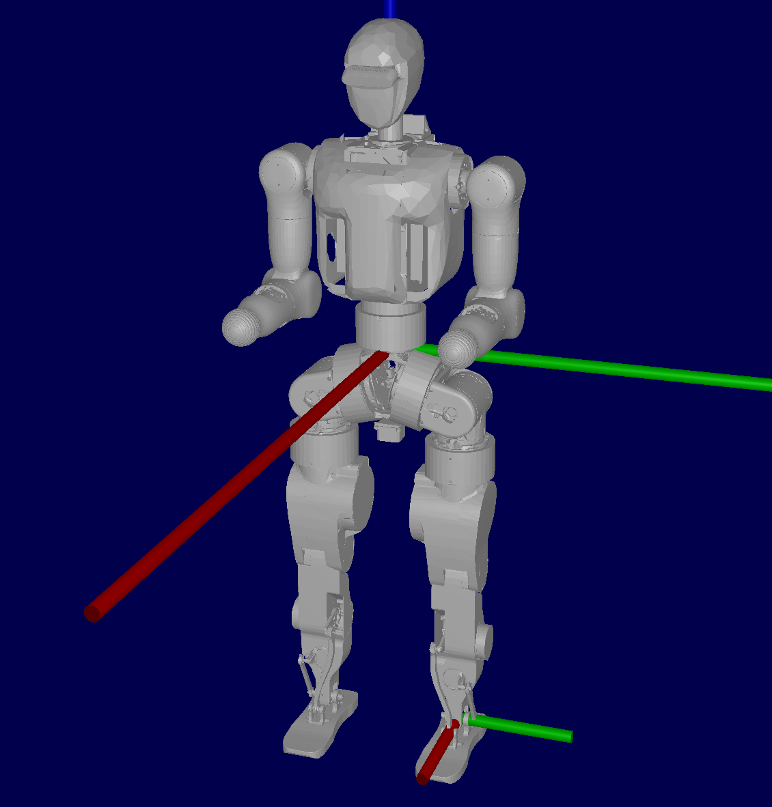

[English](README.en.md) | 简体中文

# Wiki-GRx-Models



欢迎访问 Fourier GRx 机器人模型仓库！

本仓库提供 Fourier GRx 系列机器人的统一机器人描述格式（URDF）文件，
助力开发者探索、修改和扩展该机器人平台的功能。

## 模型列表

**N1 系列**:

- N1_raw.urdf: 不含转子惯量的基础 URDF 模型
- N1_rotor.urdf: 包含转子惯量的 URDF 模型

## 模型验证

推荐使用`urdf-viz`工具进行三维可视化验证：

- https://github.com/openrr/urdf-viz

### 通过Cargo安装

```bash
sudo apt-get install cmake xorg-dev libglu1-mesa-dev
sudo apt install cargo
cargo install urdf-viz
```

### 模型可视化

```bash
cd /path/to/your/project

cd N1/urdf
urdf-viz N1_raw.urdf
```

---

感谢您对傅利叶智能 N1 机器人项目的关注！
希望本资源能为您的机器人开发提供有力支持！